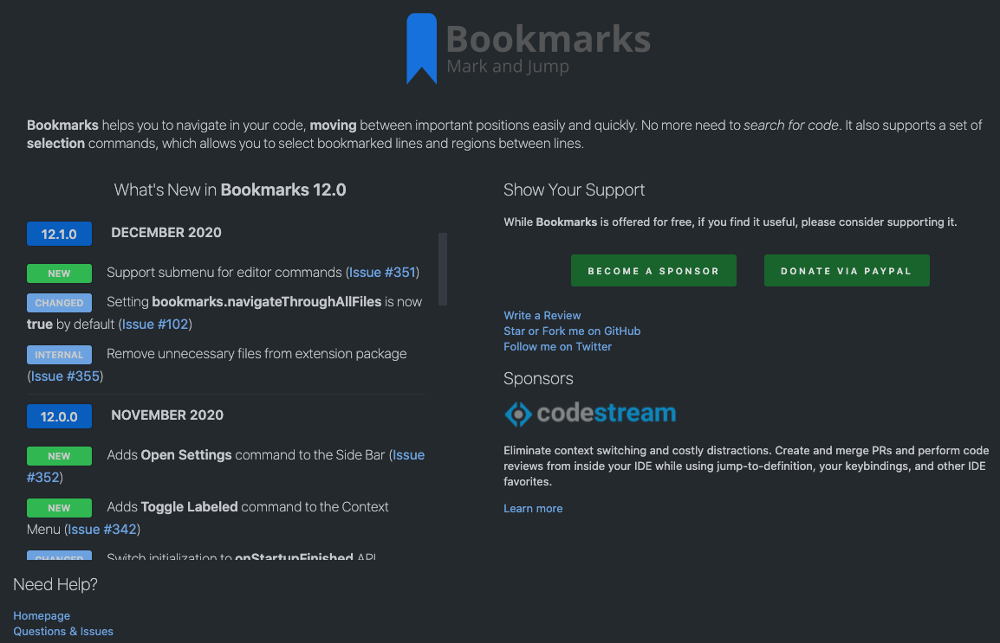

# What's New submodule

This submodule is used to display a **What's New** page on VS Code extensions. It has a simple (but yet effective) UI, optimized to display all the information in a single page.



## Usage

### Adding

You just need to add a `submodule` reference to your Git repo

```
    git submodule add https://github.com/alefragnani/vscode-whats-new.git

```

### Coding

```ts

// provide the data
import { ChangeLogItem, 
         ChangeLogKind, 
         ContentProvider, 
         SocialMediaProvider, 
         SponsorProvider, 
         Header, 
         Image
} from "../../vscode-whats-new/src/ContentProvider";

export class BookmarksContentProvider implements ContentProvider {

    provideHeader(logoUrl: string): Header {
        return <Header>{logo: <Image> {src: logoUrl, height: 50, width: 50}, 
            message: `<b>Bookmarks</b> helps you to navigate in your code, <b>moving</b> 
            between important positions easily and quickly. No more need 
            to <i>search for code</i>. It also supports a set of <b>selection</b>
            commands, which allows you to select bookmarked lines and regions between
            lines.`};
    }

    provideChangeLog(): ChangeLogItem[] {
        let changeLog: ChangeLogItem[] = [];
        changeLog.push({ kind: ChangeLogKind.VERSION, detail: { releaseNumber: "12.1.0", releaseDate: "December 2020" } });
        changeLog.push({
            kind: ChangeLogKind.NEW,
            detail: {
                message: "Support submenu for editor commands",
                id: 351,
                kind: IssueKind.Issue
            }
        });
        changeLog.push({
            kind: ChangeLogKind.CHANGED,
            detail: {
                message: "Setting <b>bookmarks.navigateThroughAllFiles</b> is now <b>true</b> by default",
                id: 102,
                kind: IssueKind.Issue
            }
        });
        changeLog.push({
            kind: ChangeLogKind.INTERNAL,
            detail: {
                message: "Remove unnecessary files from extension package",
                id: 355,
                kind: IssueKind.Issue
            }
        });
    }
}

export class BookmarksSocialMediaProvider implements SocialMediaProvider {
    public provideSocialMedias() {
        return [{
            title: "Follow me on Twitter",
            link: "https://www.twitter.com/alefragnani"
        }];
    }
}

export class BookmarksSponsorProvider implements SponsorProvider {
    public provideSponsors(): Sponsor[] {
        const sponsors: Sponsor[] = [];
        const sponsorCodeStream: Sponsor = <Sponsor>{
            title: "Learn more about Codestream",
            link: "https://sponsorlink.codestream.com/?utm_source=vscmarket&utm_campaign=bookmarks&utm_medium=banner",
            image: {
                light: "https://alt-images.codestream.com/codestream_logo_bookmarks.png",
                dark: "https://alt-images.codestream.com/codestream_logo_bookmarks.png"
            },
            width: 52,
            message: `<p>Eliminate context switching and costly distractions. 
                Create and merge PRs and perform code reviews from inside your 
                IDE while using jump-to-definition, your keybindings, and other IDE favorites.</p>`,
            extra:
                `<a title="Learn more about CodeStream" href="https://sponsorlink.codestream.com/?utm_source=vscmarket&utm_campaign=bookmarks&utm_medium=banner">
                Learn more</a>`
        };
        sponsors.push(sponsorCodeStream);
        return sponsors;
    }
}

// register the providers
const provider = new BookmarksContentProvider();
const viewer = new WhatsNewManager(context)
    .registerContentProvider("alefragnani", "bookmarks", provider)
    .registerSocialMediaProvider(new BookmarksSocialMediaProvider())
    .registerSponsorProvider(new BookmarksSponsorProvider());

// show the page (if necessary)
viewer.showPageInActivation();

// register the additional command (not really necessary, unless you want a command registered in your extension)
context.subscriptions.push(vscode.commands.registerCommand("bookmarks.whatsNew", () => viewer.showPage()));
```
## Features

### Detects version updates

It follows [SEMVER - Semantic Versioning](https://www.semver.org) to detect **Major**, **Minor** and **Patch** versions. The **What's New** page will only be displayed when a **Major** or **Minor** update occurs. **Patches** are updated silently.

### Template Based

I don't have to deal with HTML or CSS on my extensions anymore. I just have to _provide_ the relevant information and the HTML page is automatically generated/updated.

## Inspiration

The idea came from the [GitLens extension](https://marketplace.visualstudio.com/items?itemName=eamodio.gitlens) by @eamodio (big thanks to Eric Amodio :claps:). Based on pieces of its welcome page, I created this template based engine, to be able to use in any of my extensions, with minimum effort.

# License

[MIT](LICENSE.md) &copy; Alessandro Fragnani